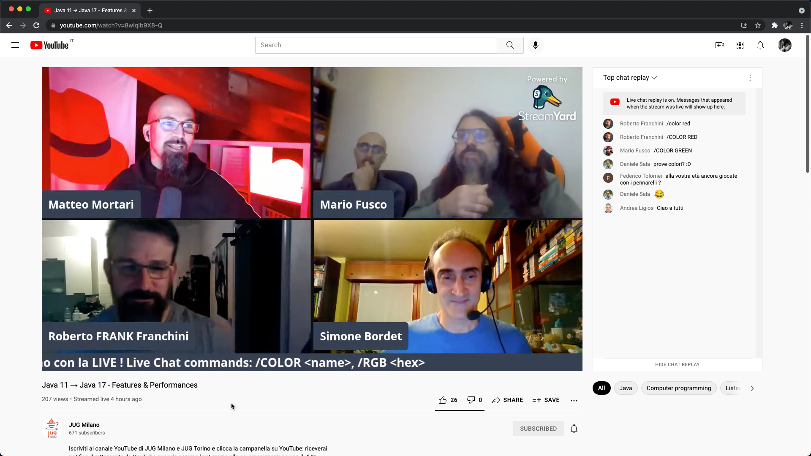

# Quarkus - another YouTube bot

YT live chat can engage with the following commands to pilot Philips Hue lights
```
/COLOR <css color name>
/RGB <hex>
```

Demo:



# Requirements

- JDK11
- Maven
- Tesseract (for OCR)

# Configuration

Use youtube with LIGHT theme! works best with OCR.

Don't forget a local .env file, with 
```
HUE_USERNAME=<hue secret username>
```

# Running as Quarkus dev

```
mvn clean generate-sources quarkus:dev
```

# Initial setup

You need to register this Quarkus application on the Philips Hue Bridge.
You can use a convenience API on this Quarkus application to obtain a "username" to be used when communicating with the Philips Hue Bridge.


Press the physical button on the Philips Hue Bridge and use this convenience endpoint again, you will obtain the "username" as this Quarkus application gets successfully registered on the Philips Hue Bridge. Configure this "username" value in a local .env file, as described above.

For more information: https://developers.meethue.com/develop/get-started-2

# Capture area for OCR 🤷🚀

To preserve quota limit on using YT's API, this application instead takes a different approach of capturing a local screenshot at regular intervals, and performs OCR on it.

🤷🚀

This comes with some known disadvantages, such as loss in precision while acquiring the chat text.

The area boundaries to be caputured are configured in `application.properties` at each restart of the application.


You can use an utility API which will spawn a Swing JFrame to set new boundaries as needed.


The same utility API can reset the boundaries at the top-left corner of the screen, while the application is still running.

# Simulation testing 🙊

As the best dirty hacks, this application does not provide (yet?) solid unit or integration testing.

However, one can always perform end-to-end (E2E) simulation testing by running this application,
opening a past live-stream on YouTube,
and use the browser's Developer Tools to simulate the commands by rewriting a random user's comment in the live-chat replay on the side.


